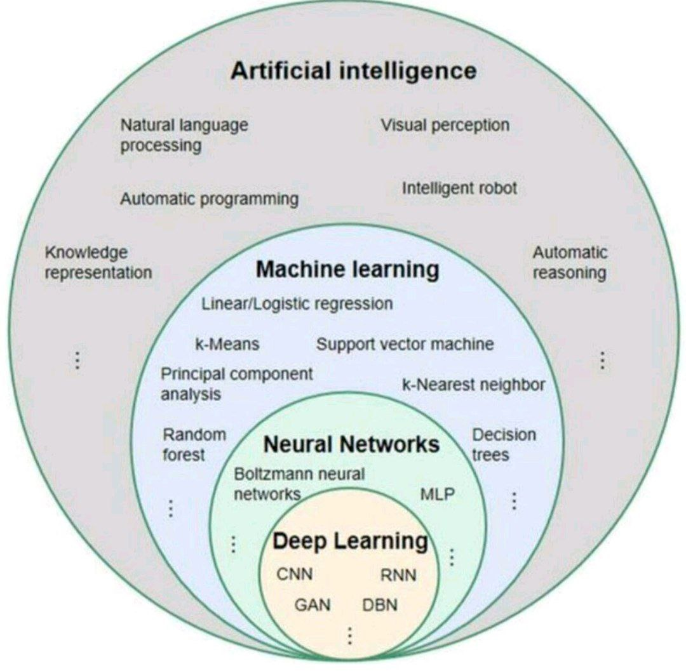
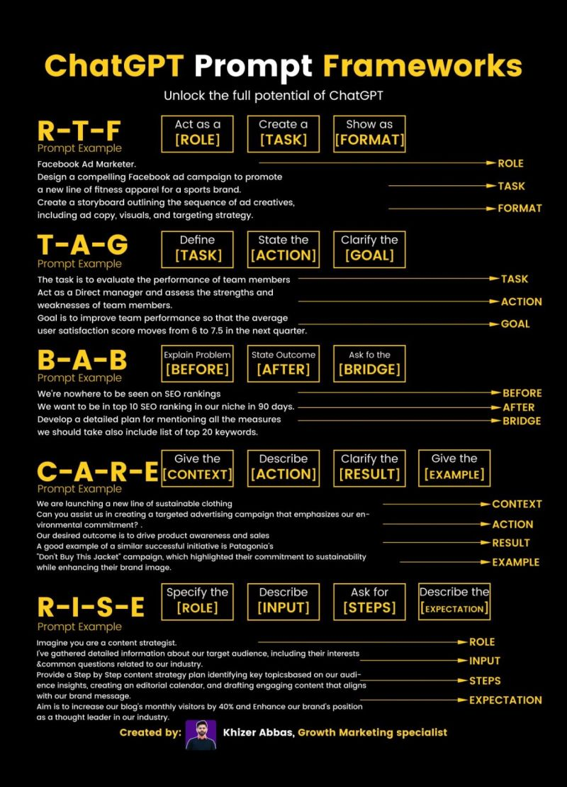

# Üretken Yapay Zeka Atöylesi

  
  

  Author:
    <a href="https://linktr.ee/muffafa" target="_blank">Muhammed Mustafa (muffafa) Savar</a> 
    <small> May, 2024</small>
  

---

**🚨 Bu içerik tamamlanmamış olup sürekli olarak güncellenecektir...**

## 👁️ Yapay Zeka Nedir?

### 1- Yapay Zeka Kısa Tarihi

<https://tr.wikipedia.org/wiki/Yapay_zek%C3%A2>

Yapay Zekanın Tarihsel Gelişimi

- 1956 - İstatistiksel Modelleme: İnsan zekasını taklit edebilen veya aşabilen akıllı makineler yaratmayı amaçlayan bilgisayar bilimi alanı.
  
- 1997 - Makine Öğrenmesi: Makinelerin mevcut verilerden öğrenmesini ve tahminler yapmasını sağlayan yapay zeka alt kümesi.
  
- 2017 - Derin Öğrenme: Verileri işlemek ve karar vermek için sinir ağlarının katmanlarının kullanıldığı bir makine öğrenimi tekniği.

- 2021 - Generative AI: Bilgi istemleri veya mevcut verilerle yeni yazılı, görsel ve işitsel içerik oluşturma teknolojisi.

Yapay Zeka Tarihi ve Weizenbaum Hakkında
Weizenbaum’s nightmares: how the inventor of the first chatbot turned
against AI:
<https://www.theguardian.com/technology/2023/jul/25/joseph-weizenbaum-inventor-eliza-chatbot-turned-against-artificial-intelligence-ai>

Tay Chatbot - Microsoft
<https://en.wikipedia.org/wiki/Tay_(chatbot)>

### 2- Yapay Zeka Türleri ve Kavramları

**Zayıf yapay zeka**, belirli görevlerde insan zekasını taklit edebilen ancak geniş çaplı zeka ve öğrenme yeteneklerine sahip olmayan sistemlerdir. Yetenekleri, tasarlandıkları görevlerle sınırlıdır. Örnekler arasında dijital asistanlar ve e-posta filtreleme sistemleri bulunur.

**Güçlü yapay zeka**, insan zekasına daha yakın yeteneklere sahip olan ve çeşitli görevlerde insan zekasını taklit edebilen sistemlerdir. Karmaşık problemlerle başa çıkabilir ve öğrenme yetenekleri sayesinde kendilerini geliştirebilirler. Dil modelleri, derin öğrenme algoritmaları, otonom araçlar ve İHA'lar bu kategoriye örnek gösterilebilir.

**Yapay genel zeka (AGI)**, insan zekasının tüm alanlarda eşdeğer veya üstün performans gösteren yapay zeka sistemleridir ve şu an için sadece teorik bir kavramdır. Tüm alanlarda genel bir anlayış ve problem çözme yeteneği sağlayabilir. Ancak, bu teknolojinin geliştirilmesi potansiyel etik ve güvenlik sorunları yaratabilir.

### Genel Terimler (Açıklayıcı)

- **LLM (Large Language Models)**: Bir milyar veya daha fazla parametre içeren, dil işleme yeteneklerine sahip modeller. **Vektör**, dil modellerinde anlamı temsil eden sayısal değerler dizisidir.
- **Ada GPT, Dall-e2, Rainbow, Whisper, Currie**: Metin biçimlendirme, görsel oluşturma, ses komutlarını metne çevirme gibi alanlarda uzmanlaşmış modeller.
- **Fine Tuning**: Verilerin özel ihtiyaçlara göre yapay zekaya yanıt verecek şekilde uyarlanması işlemi.
- **Prompt**: Yapay zekaya ne hakkında yanıt vermesi gerektiğini belirten komut veya sorgu.
- **Token**: Yapay zeka modellerinde kelimelerin veya kelime parçalarının hesaplamalarda kullanıldığı birim. 1000 token yaklaşık 750 kelimeye eşittir. <https://help.openai.com/en/articles/4936856-what-are-tokens-and-how-to-count-them>
- **Copilot**: Kullanıcı verimliliğini artıran yapay zeka asistanı. Microsoft tarafından yayınlanmıştır. <https://copilot.microsoft.com/>
- **ChatGPT**: OpenAI tarafından geliştirilen, diyalog konusunda uzmanlaşmış yapay zeka sohbet robotu. <https://chat.openai.com/>
- **Open AI**: ChatGPT, GPT-4, GPT4-O modelini geliştiren şirket.
- **GPT (Generative Pre-Trained Transformer)**: Önceden eğitilmiş, metin üretme ve dönüştürme görevleri için kullanılan bir yapay zeka modeli. **Transformer**, veri içindeki ilişkileri öğrenmeyi sağlayan bir sinir ağı mimarisidir.
- **Llama**: Facebook tarafından geliştirilen büyük dil modeli. Açık kaynaktır. <https://llama.meta.com/>
- **Gemini**: Google tarafından geliştirilen büyük dil modeli. Google araçları ile etkileşimlidir. <https://gemini.google.com/>

### Temel ve İleri Yapay Zeka Kavramları

#### 1. Yapay Zeka (Artificial Intelligence)

- **Tanım**: Makinelerin insan benzeri zeka sergilemesi.
- **Kapsam**:
  - Doğal Dil İşleme (Natural Language Processing)
  - Görsel Algı (Visual Perception)
  - Otomatik Programlama (Automatic Programming)
  - Bilgi Temsili (Knowledge Representation)
  - Akıllı Robot (Intelligent Robot)
  - Otomatik Akıl Yürütme (Automatic Reasoning)

#### 2. Makine Öğrenmesi (Machine Learning)

- **Tanım**: Makinelerin verilerden öğrenmesini sağlayan yöntemler bütünü.
- **Yöntemler**:
  - Doğrusal/Logistik Regresyon (Linear/Logistic Regression)
  - K-ortalama Kümeleme (k-Means Clustering)
  - Destek Vektör Makineleri (Support Vector Machines)
  - Ana Bileşen Analizi (Principal Component Analysis)
  - K-en Yakın Komşu (k-Nearest Neighbor)
  - Rastgele Ormanlar (Random Forests)
  - Karar Ağaçları (Decision Trees)

#### 3. Sinir Ağları (Neural Networks)

- **Tanım**: İnsan beynindeki sinir hücrelerini taklit eden bilgi işleme sistemleri.
- **Yöntemler**:
  - Çok Katmanlı Algılayıcılar (MLP - Multilayer Perceptrons)
  - Boltzmann Sinir Ağları (Boltzmann Neural Networks)

#### 4. Derin Öğrenme (Deep Learning)

- **Tanım**: Verileri çok katmanlı sinir ağlarıyla işleyen makine öğrenimi yöntemi.
- **Yöntemler**:
  - Konvolüsyonel Sinir Ağları (CNN - Convolutional Neural Networks)
  - Tekrarlayan Sinir Ağları (RNN - Recurrent Neural Networks)
  - Üretici Çekişmeli Ağlar (GAN - Generative Adversarial Networks)
  - Derin İnanç Ağları (DBN - Deep Belief Networks)

### 3- Yapay Zekanın Kullanım Alanları

## 🤖 Prompt Mühendisliği ve Yapay Zeka Araçları

- Prompt Yazım Teknikleri <https://github.com/atilsamancioglu/PromptEngineeringCourse/blob/main/TurkishGuide.md>

- Metin için Üretken Yapay Zeka Araçları: ChatGPT, Gemini
- Görsel için Üretken Yapay Zeka Araçları: Microsoft Copilot, Canva, Midjourney, Adobe Firefly
- Video için Üretken Yapay Zeka Araçları: Runway
- Ses için Üretken Yapay Zeka Araçları: Murf.AI
- Sunum için Üretken Yapay Zeka Araçları: Gamma
- Kod için Üretken Yapay Zeka Araçları: GitHub Copilot, Devin
- Diğer Üretken Yapay Zeka Araçları: ChatPDF, Notion.AI, Merlin

## 👀 Etik, Yasal ve Toplumsal Yönleri

- Telif Hakları ve Fikri Mülkiyet
- Özgünlük ve Yaratıcılık Üzerine Etkileri
- İşgücü ve Meslekler Üzerine Etkileri
- Önyargı ve Ayrımcılık
- Yanıltıcı İçerik ve Sahte Bilgi Üretimi (Deepfake ve Dezenformasyon)
- Üretken yapay zekanın sorumlu kullanımı

## Ek Kaynkalar

- Elements of AI: <https://course.elementsofai.com/>
- GPT-4o vs. GPT-4 vs. Gemini 1.5 — Performance Analysis <https://medium.com/@lars.chr.wiik/gpt-4o-vs-gpt-4-vs-gemini-1-5-performance-analysis-6bd207a2c580>
- [ChatGPT Her Şeyi Nasıl Bilebiliyor? (Youtube / Evrim Ağacı)](https://youtu.be/7foCbOktTZM?si=XR5aBkWGWALC5ysD)

## Haberler

### YouTube Kanalları

- [@cicekileteknoloji](https://www.youtube.com/@cicekileteknoloji)
- [@erhanmeydan](https://www.youtube.com/@erhanmeydan)
- [@bo-sar](https://www.youtube.com/@bo-sar)
- [@engineerprompt](https://www.youtube.com/@engineerprompt)
- [@AIJasonZ](https://www.youtube.com/@AIJasonZ)

### Diğer

- Grok <https://youtu.be/EdjGnqM1AjI?si=TfTw_DPJ0PDudk7Q>
- Microsoft Build 2024: Everything Revealed in 9 Minutes <https://www.youtube.com/watch?v=w1EepB0mCbE>
- Sora - Creating video from text <https://openai.com/index/sora/>
- GPT-4o Her Şeyi Değiştirir! <https://youtu.be/jZxV38uo6fE?si=Nhx9X469o9LzblHr>
- Devin AI <https://www.ntv.com.tr/teknoloji/dunyanin-ilk-yapay-zeka-yazilim-muhendisi-devin,VRZ1WLa4qE2_si80pHwRXw>
